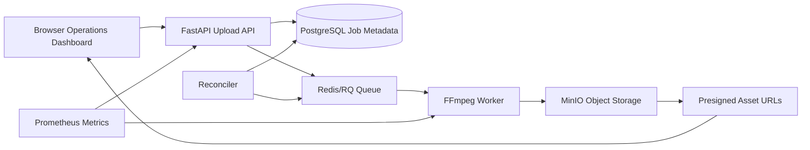

# Distributed Video Processing Infrastructure

A cloud-deployed asynchronous video-processing platform built around a FastAPI upload API, Redis/RQ workers, FFmpeg processing, PostgreSQL job metadata, and MinIO/S3-compatible object storage. The project includes a Next.js operations dashboard, Kubernetes manifests, GHCR-published images, and a reproducible Azure AKS demo overlay for validating the full upload-to-asset flow.

This is a demo infrastructure project designed to exercise backend, distributed systems, and cloud deployment concerns without claiming production traffic or real customer usage.

## Demo

[](https://www.youtube.com/watch?v=GMABOmyEaMo)

Click the image above -> redirects to demo

The demo shows:

- Azure AKS deployment proof.
- Kubernetes pods and services running.
- Health checks for the API, queue, and object storage.
- Frontend upload through the operations dashboard.
- Redis/RQ asynchronous processing.
- FFmpeg worker completion.
- Processed video and thumbnail asset retrieval.
- Idempotent upload reuse with the same idempotency key.

## Architecture



- The API validates uploads, writes job metadata, stores raw objects, and enqueues work.
- Redis/RQ decouples upload latency from FFmpeg processing.
- Workers generate processed video and thumbnail assets.
- MinIO provides S3-compatible object storage and short-lived presigned asset URLs.
- The reconciler handles stuck queued/processing jobs and recovery flows.

## Tech Stack

| Area | Tools |
| --- | --- |
| Backend | FastAPI, Python, SQLAlchemy, Alembic |
| Queue / Workers | Redis, RQ, FFmpeg |
| Storage | MinIO / S3-compatible object storage |
| Database | PostgreSQL |
| Frontend | Next.js, React operations dashboard |
| Deployment | Docker, Kubernetes, Azure AKS, GHCR |
| Observability | Prometheus-compatible metrics, Grafana-ready dashboards, Jaeger/OpenTelemetry-ready tracing |
| CI/CD | GitHub Actions, GHCR image publishing |

## Core Features

- Async video uploads.
- Queue-backed processing.
- FFmpeg processed video and thumbnail generation.
- Object-storage-backed raw, processed, and thumbnail assets.
- Short-lived presigned asset URLs.
- Idempotency keys for duplicate-safe uploads.
- Retry-aware job state tracking.
- Stuck job recovery and automated reconciler.
- Lifecycle cleanup policy.
- Upload rate limiting.
- Queue admission and backpressure checks.
- Health endpoints.
- Frontend operations dashboard.

## Cloud Deployment: Azure AKS

The project was deployed to Azure AKS using GHCR images. The demo ran the API, frontend, worker, reconciler, PostgreSQL, Redis, and MinIO as Kubernetes workloads, then verified the full upload → queue → processing → object storage → asset retrieval flow.

The Azure resource group was deleted after recording to avoid ongoing cloud costs. The repo keeps the reproducible AKS overlay so the deployment can be recreated.

```bash
az aks get-credentials \
  --resource-group rg-video-processing-demo \
  --name aks-video-processing-demo \
  --overwrite-existing

kubectl kustomize k8s/overlays/azure-aks \
  --load-restrictor=LoadRestrictionsNone | kubectl apply -f -
```

Port-forward the demo services:

```bash
kubectl port-forward -n video-processing svc/video-processing-api 8000:80
kubectl port-forward -n video-processing svc/video-processing-frontend 3000:80
kubectl port-forward -n video-processing svc/video-processing-minio 9000:9000
```

Browser demo URL:

```text
http://localhost:3000
```

Cleanup after the demo:

```bash
az group delete \
  --name rg-video-processing-demo \
  --yes \
  --no-wait
```

## Local Development

Docker Compose remains the quickest way to run the full stack locally, including PostgreSQL, Redis, MinIO, API, workers, reconciler, Prometheus, Grafana, Jaeger, and the frontend dashboard.

```bash
docker compose up --build
```

Local service URLs:

- Frontend dashboard: `http://localhost:3001`
- API: `http://localhost:8000`
- MinIO console: `http://localhost:9001`
- Prometheus: `http://localhost:9090`
- Grafana: `http://localhost:3000`
- Jaeger: `http://localhost:16686`

Basic health checks:

```bash
curl http://localhost:8000/health
curl http://localhost:8000/api/v1/queue/health
curl http://localhost:8000/api/v1/storage/health
```

## API Endpoints

| Method | Endpoint | Purpose |
| --- | --- | --- |
| GET | `/health` | API health check |
| POST | `/api/v1/videos/upload` | Upload and enqueue a video |
| GET | `/api/v1/videos/{id}/status` | Read job status and processing metadata |
| GET | `/api/v1/videos/{id}/assets` | Get presigned raw/processed/thumbnail asset URLs |
| GET | `/api/v1/queue/health` | Inspect queue depth, workers, and pressure |
| GET | `/api/v1/storage/health` | Verify object storage connectivity and buckets |
| GET | `/metrics` | Prometheus-compatible metrics |

## Reliability and Recovery

Idempotency prevents duplicate processing for retried uploads. Retry-aware job tracking stores attempts and failure metadata, while stuck job recovery handles jobs left in queued or processing states after worker interruptions.

The automated reconciler uses Redis-backed locking so multiple reconciler instances do not recover the same job concurrently. Cleanup policy support handles old completed/failed job data, queue admission control rejects uploads when pressure is too high, and upload validation plus rate limiting protect the ingestion path.

## Observability

The project exposes Prometheus-compatible metrics for API requests, queue depth, worker count, video processing, object storage, cleanup, retries, stuck jobs, and reconciler behavior. It also includes structured logging, health endpoints, Jaeger/OpenTelemetry-ready tracing, Prometheus alert rules, and Grafana dashboard definitions.

## Benchmark Results

Scaling workers from 1 → 5 improved local benchmark throughput from 4.46 uploads/sec to 11.13 uploads/sec and reduced wall-clock completion time from 3.36s to 1.35s.

This was a local benchmark under active upload protection/rate limiting and should be interpreted as development pressure testing, not formal production benchmarking.

| Workers | Throughput | Wall-clock completion |
| --- | --- | --- |
| 1 | 4.46 uploads/sec | 3.36s |
| 5 | 11.13 uploads/sec | 1.35s |

This showed a 2.5x throughput improvement from horizontal worker scaling in the local benchmark environment.

## Repository Structure

```text
backend/                    FastAPI app, API routes, models, config, migrations
workers/                    RQ worker and reconciler entrypoints
frontend/                   Next.js operations dashboard
k8s/                        Kubernetes manifests and overlays
k8s/overlays/azure-aks      Reproducible Azure AKS demo overlay
scripts/                    Benchmarks, smoke tests, deployment helpers
k8s/*.md                    Operations and deployment notes
benchmark-results/          Local benchmark reports
```

## Future Improvements

- Managed Postgres, Redis, and object storage for production deployment.
- Ingress and TLS instead of local port-forward demo.
- Autoscaling workers based on queue depth.
- Persistent volumes or managed storage for long-running object/database state.
- Deeper Grafana dashboards and alerting.
- Production secret management through a cloud secret manager.
- More extensive load testing with larger video files and longer benchmark windows.
